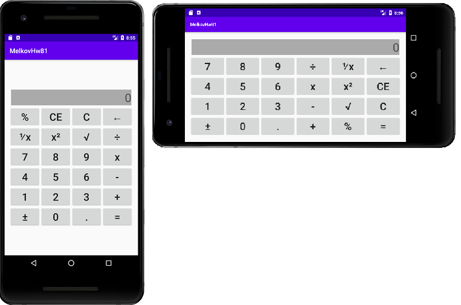

## Задача 1. Адаптивная горизонтально-вертикальная верстка.
### Описание
Большинство приложений Android могут работать как в горизонтальном, так и в вертикальном виде. Для обеспечения этой возможности используется 2 набора файлов верстки для каждого вида соответственно. Переведите свой экран калькулятора на использование этой возможности. Создайте альтернативную верстку экрана калькулятора в соответствующей папке таким образом, чтобы элементы не пропадали с экрана и сохраняли гармоничное расположение.

